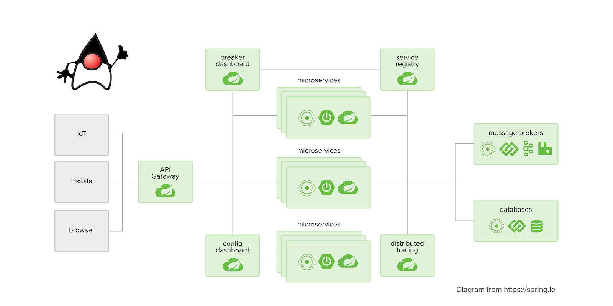

# Thiết kế code base microservice theo mô hình của Netflix

## 1. Discovery server

## 2. Spring cloud gateway

## 3. Authentication service

## 4. Account service

## 5. Config server

## 6. Zipkin server

## 7. Hystrix

## 8. Elasticsearch Fluent Kibana

---
Source reference: https://spring.io/cloud
>Developing distributed systems can be challenging. Complexity is moved from the application layer to the network layer and demands greater interaction between services. Making your code ‘cloud-native’ means dealing with 12-factor issues such as external configuration, statelessness, logging, and connecting to backing services. The Spring Cloud suite of projects contains many of the services you need to make your applications run in the cloud.
